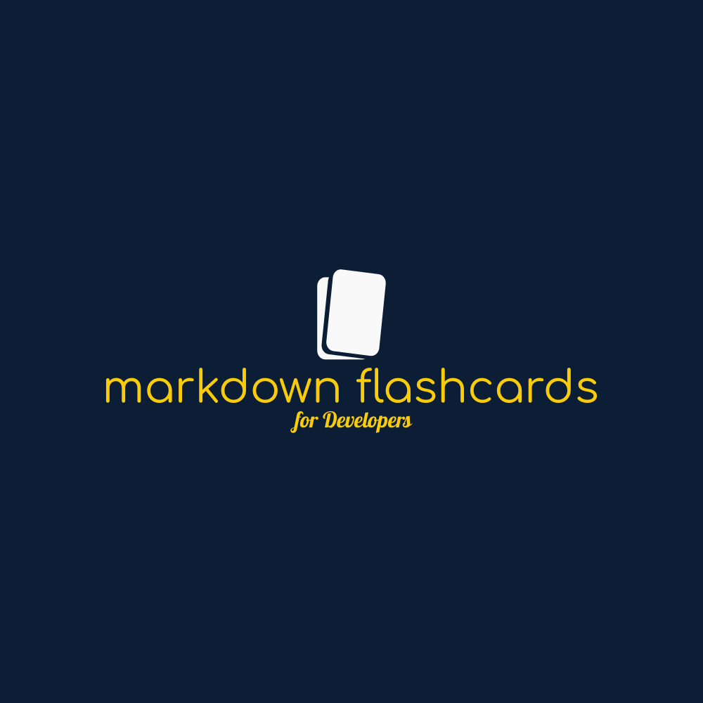

<br>
<p align="center">
<a href="https://github.com/ChrisTowles/markdown-flashcards" target="_blank">

</a>
</p>

<p align="center">
Markdown Based Flashcards using Spaced repetition for Developers.
</p>

## Credit

Inspired by and forked from [Slidev](https://github.com/slidevjs/slidev)  by Anthony Fu.

## Why

Using flashcards and spaced repetition for learning is great, but I found the [ANKI](https://apps.ankiweb.net/) hard to use and UI really dated. I tried looking for alternatives and used brainscape but Anki seems to be the gold standard. So the goal is to make a developer friendly version that is free and easy to modify in Markdown, and share modify cards via git repos.

This project was started as a **fork** of Anthony Fu's amazing [Slidev](https://sli.dev/) which I'm using as the starting point and then starting to modify the repo from there. I started first by just creating empty repo and coping parts of the code from Slidev and then modifying it to work with flashcards.

## What is Spaced repetition

When learning flashcards can be really powerful tool. With technology, we can employ <https://en.wikipedia.org/wiki/Spaced_repetition>.

> Spaced repetition is an evidence-based learning technique that is usually performed with flashcards. Newly introduced, and more difficult flashcards are shown more frequently, while older and less difficult flashcards are shown less frequently in order to exploit the psychological spacing effect. The use of spaced repetition has been proven to increase the rate of learning.

## Features
<!--
- 📝 [**Markdown-based**](https://sli.dev/guide/syntax.html) - use your favorite editors and workflow
- 🧑‍💻 [**Developer Friendly**](https://sli.dev/guide/syntax.html#code-blocks) - built-in syntax highlighting, live coding, etc.
- 🎨 [**Themable**](https://sli.dev/themes/gallery.html) - theme can be shared and used with npm packages.
- 🌈 [**Stylish**](https://sli.dev/guide/syntax.html#embedded-styles) - on-demand utilities via [Windi CSS](https://windicss.org/) or [UnoCSS](https://github.com/unocss/unocss).
- 🤹 [**Interactive**](https://sli.dev/custom/directory-structure.html#components) - embedding Vue components seamlessly.
- 🎙 [**Presenter Mode**](https://sli.dev/guide/presenter-mode.html) - use another window, or even your phone to control your slides.
- 🧮 [**LaTeX**](https://sli.dev/guide/syntax.html#latex) - built-in LaTeX math equations support.
- 📰 [**Diagrams**](https://sli.dev/guide/syntax.html#diagrams) - creates diagrams with textual descriptions
- 🌟 [**Icons**](https://sli.dev/guide/syntax.html#icons) - access to icons from any iconset directly.
- 💻 [**Editors**](https://sli.dev/guide/editors.html) - integrated editor, or [extension for VS Code](https://github.com/slidevjs/slidev-vscode)
- 🎥 [**Recording**](https://sli.dev/guide/recording.html) - built-in recording and camera view.
- 📤 [**Portable**](https://sli.dev/guide/exporting.html) - export into PDF, PNGs, or even a hostable SPA.
- ⚡️ [**Fast**](https://vitejs.dev) - instant reloading powered by [Vite](https://vitejs.dev).
- 🛠 [**Hackable**](https://sli.dev/custom/config-vite.html) - using Vite plugins, Vue components, or any npm packages.
-->
## Getting Started
<!-- 
### Init Project Locally

Install [Node.js >=14](https://nodejs.org/) and run the following command:

```bash
npm init slidev
```
-->
## Tech Stack

- [Vite](https://vitejs.dev) - An extremely fast frontend tooling
- [Vue 3](https://v3.vuejs.org/) powered [Markdown](https://daringfireball.net/projects/markdown/syntax) - Focus on the content while having the power of HTML and Vue components whenever needed
- [Windi CSS](https://github.com/windicss/windicss) / [UnoCSS](https://github.com/unocss/unocss) - On-demand utility-first CSS framework, style your slides at ease
- [Prism](https://github.com/PrismJS/prism), [Shiki](https://github.com/shikijs/shiki), [Monaco Editor](https://github.com/Microsoft/monaco-editor) - First-class code snippets support with live coding capability
- [RecordRTC](https://recordrtc.org) - Built-in recording and camera view
- [VueUse](https://vueuse.org) family -  [`@vueuse/core`](https://github.com/vueuse/vueuse), [`@vueuse/head`](https://github.com/vueuse/head), [`@vueuse/motion`](https://github.com/vueuse/motion), etc.
- [Iconify](https://iconify.design/) - Iconsets collection.
- [Drauu](https://github.com/antfu/drauu) - Drawing and annotations support
- [KaTeX](https://katex.org/) - LaTeX math rendering.
- [Mermaid](https://mermaid-js.github.io/mermaid) - Textual Diagrams.

## History

I (Chris Towles) think this makes the ~~third time~~ (fifth and counting) I've started writing flashcard application, I've done them in `vue`, `flutter`, and `angular` in the past. Flipping flashcards on the screen was always easy but when managing a backend/database to allow sharing flashcard decks, edit and created decks always ended up a big mess. I've designed databases and Firebase backends but in the end I felt the amount of work required lead to me making trade-offs and losing interest as the complexity went up.

This time I link will be different. By allowing git and GitHub to basically be the backend, and I can use the web tooling of [Vite](https://vitejs.dev/), [vitest](https://vitest.dev/), and node and just keep everything on local storage. I can also integrate with the ANKI API later if wanted.

The goal of using Markdown comes because I document and take notes every day in Markdown and the flow and productivity is amazing. Using GitHub Copilot, plus a few vs-code [grammar extensions](https://github.com/ChrisTowles/dotfiles/blob/main/vscode-extendsions.md#grammar-and-spelling) makes it so productive. Add the ability to copy and paste images into the markdown via extensions, and it's nearly perfect.

~~I copied a lot this project from [Anthony Fu's](https://github.com/sponsors/antfu) [Slidev](https://github.com/slidevjs/slidev) as the starting point and then starting to modify the repo from there.~~

That was the original plan, but I've decided to fork from [slidev](https://sli.dev/) after realize how much I was going to have to copy from and because it couldn't tell if anything was working till all copied it was a mess.

First I learn so much from reading others code and reading Anthony's code is always top-notch. If you don't know who he is, he's basically the most [productive developer](https://github.com/antfu) ever! And besides after using `Slidev` and then looking at its source it was a large part of the inspiration to start this project again.

## Other

- [Troubleshooting](./docs/troubleshooting.md)
- Extension [antfu.slidev](https://marketplace.visualstudio.com/items?itemName=antfu.slidev) can be used by adding user or `.vscode/settings.json`
 to include

```json
{
  // .. other settings
// make slidev extension work even when @slidev/cli is not installed
  "slidev.enabled": true
}
```

## License

MIT License © 2021 [Anthony Fu](https://github.com/antfu)

Keeping the MIT license for from the fork from slidev.
